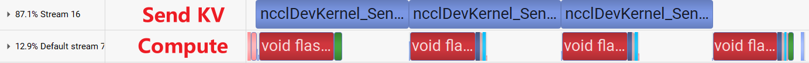

# TokenRing

## Introduction
This repo provides a sequence parallel approach based on Ring Attention, which leverages inter-node P2P bidirectional communication to reduce communication overhead and enhance scalability. This innovation im-
proves computation-communication overlap and accelerates processing in attention.

## Installation
The casual_test folder in our work is based on [ring-flash-attention](https://github.com/zhuzilin/ring-flash-attention), which implements unit test for attention with causality; You can just install ring-flash-attention and replace corresponding file.

## Usage
Please refer to test/test_zigzag_ring_flash_attn_func.py for usage. Or you can just use run.sh.

## Performance
we performed experiments using nvidia A10 GPUs. Four GPUs are situated within the same node and interconnected via PIX (connections traversing at most a single PCIe bridge) and PXB (connections traversing multiple PCIe bridges without crossing the PCIe Host Bridge). We assessed the inference performance of the Token Ring using the LLaMA2-7B model configuration, with d = 128 and nheads = 32 for the MHA.

### TokenRing

### Ring Attention

we present the experimental results of attention with a sequence length of 2,4000 on a 4-card A10 platform. The analysis results obtained through nsight system are illustrated in the figure. As can be seen from the figure, under this sequence length, the token ring can basically achieve the overlap of Q transmission and computation at step 0 and step 1, with a time of approximately 3.5 ms. When Q, Out are transmitted simultaneously and computation is carried out at step 2, due to the connection mode of PXB, the time increases to some extent, approximately 4.6 ms. In contrast, for the ring attention, since the communication time is significantly longer than the computation time, communication becomes the bottleneck in each round, with a time of about 7.6 ms. In this scenario, the advantage of the two-way communication of the token ring is already evident. With the increase in the number of GPUs and the transformation of the GPU connection topology into a full mesh, this advantage will become more pronounced.

We have also integrated the Token ring into [xDit](https://github.com/xdit-project/xDiT). To use it, after installing xDit, you need to replace corresponding files as follows.

attn_layer.py: yunchang>hybrid>attn_layer.py
attn_layer_xdit.py: xDit>xfuser>core>long_ctx_attention>hybrid>attn_layer.py
globals.py: yunchang>globals.py
utils.py: yunchang>ring>utils.py
ring_flash_attn.py: xDit>xfuser>core>long_ctx_attention>ring>ring_flash_attn.py
